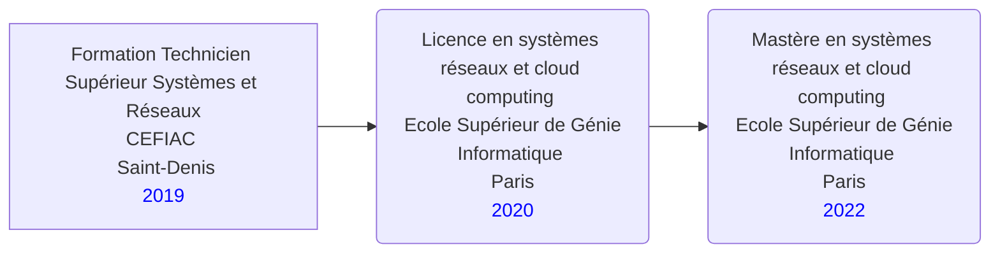

# AISSAOUI Bilel

 

**Passions:** Photographie, Bricolage

## Expérience

  
DevOps Engineer - Thales (2020 - Présent)

- Gestion et configuration des outils DevOps pour le déploiement continu
- Automatisation des processus de développement, de test et de déploiement
- Collaboration étroite avec les équipes de développement et d'exploitation

  
AAREON

- Gestion et configuration des outils DevOps pour le déploiement continu

  
HEETCH

- Gestion et configuration des outils DevOps pour le déploiement continu

  
CCMP

- Gestion et configuration des outils DevOps pour le déploiement continu

### Stage en Développement Web - ABC Company (2019)
- Développement et maintenance d'un site web utilisant HTML, CSS et JavaScript
- Mise en place de fonctionnalités interactives et responsives

## Éducation

## Compétences

- Outils de déploiement : Docker, Kubernetes
- Systèmes d'exploitation : Linux, Windows
- Langages de programmation : Python, Bash, JavaScript
- Outils de gestion de versions : Git, SVN

## Projets personnels

### Portfolio de Photographie (2018 - Présent)
- Création et maintenance d'un site web pour présenter ma collection de photographies
- Utilisation de HTML, CSS et JavaScript pour le développement du site

## Contact

- Email: aissaoui.bilel@example.com
- Téléphone: +1234567890
- Site web: [www.example.com](https://www.example.com)

**That Other Job You Had**

Also with a short description.

Technical Experience
--------------------

My Cool Side Project
:   For items which don't have a clear time ordering, a definition
    list can be used to have named items.

    * These items can also contain lists, but you need to mind the
      indentation levels in the markdown source.
    * Second item.

Open Source
:   List open source contributions here, perhaps placing emphasis on
    the project names, for example the **Linux Kernel**, where you
    implemented multithreading over a long weekend, or **node.js**
    (with [link](http://nodejs.org)) which was actually totally
    your idea...

Programming Languages
:   **first-lang:** Here, we have an itemization, where we only want
    to add descriptions to the first few items, but still want to
    mention some others together at the end. A format that works well
    here is a description list where the first few items have their
    first word emphasized, and the last item contains the final few
    emphasized terms. Notice the reasonably nice page break in the pdf
    version, which wouldn't happen if we generated the pdf via html.

:   **second-lang:** Description of your experience with second-lang,
    perhaps again including a [link] [ref], this time placing the url
    reference elsewhere in the document to reduce clutter (see source
    file). 

:   **obscure-but-impressive-lang:** We both know this one's pushing
    it.

:   Basic knowledge of **C**, **x86 assembly**, **forth**, **Common Lisp**

[ref]: https://github.com/githubuser/superlongprojectname

Extra Section, Call it Whatever You Want
----------------------------------------

* Human Languages:

     * English (native speaker)
     * ???
     * This is what a nested list looks like.

* Random tidbit

* Other sort of impressive-sounding thing you did
